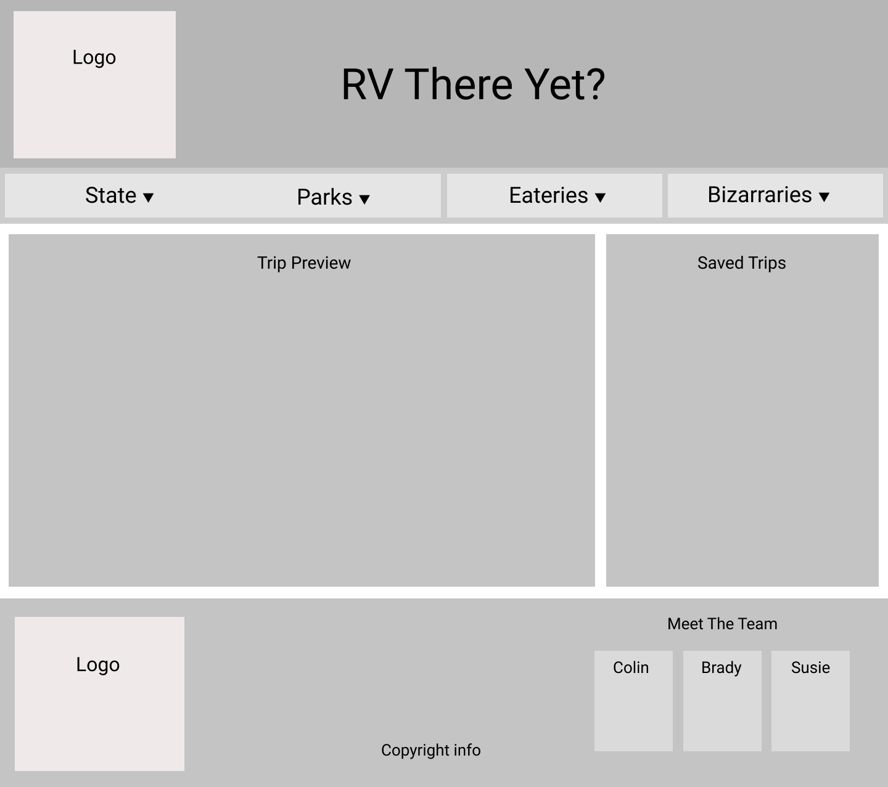

# RV There Yet?	:national_park:

**RV There Yet?** is a trip planning website designed for the would be traveler to find and explore destinations along their way.  Searching a trip will allow you to explore National Parks, oddities and eateries along your way as well as give you access to the information to plan the perfect trip.  

## Setup
---
### Local Server

To get the full features from **RV There Yet?** you will need to host a server for your database locally.  Using the Node Project Manager (npm) this can be installed with the following command in terminal. 

    npm i -g json-server

Once this is installed run json-server from the projects root directory of the application.

    json-server -p 8088 -w api/db.json

### API Keys

The application is currenlty limited to require personal access keys for access to the external APIs.  Use the links provided below to generate a key locally (all freely available).Once generated, save each key to  `example.settings.js` and rename the file to `settings.js`.

 - [Generate a National Park Service API Key](https://www.nps.gov/subjects/digital/nps-data-api.htm)
 - [Generate a Weather API Key](https://openweathermap.org/api)
 - [Generate a Graphhopper API Key](https://graphhopper.com/dashboard/#/register)

## Meet The Design Team
---
Each member of the design team is available for help with the project or other questions you might have.  Reach out to us on LinkIn. 
 - [Colin Miller](https://www.linkedin.com/in/colin-miller-587704212)

 - [Brady Williams](https://www.linkedin.com/in/brady-c-williams)

 - [Susie Stanley](https://www.linkedin.com/in/susie-stanley)

## Design Templates

### Ealy Wireframe Design

### Project ERD Diagram

